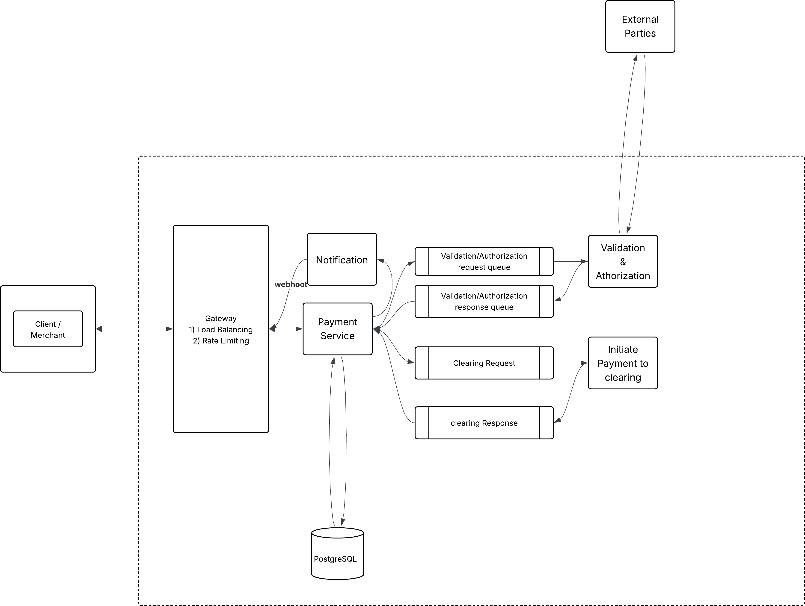

# Payment Processing System Design

## Overview

This document describes the architecture of a scalable payment processing system that supports online transactions, authorization, refunds, and settlement workflows. The system is designed to handle high transaction volumes while maintaining strong reliability, security, and observability.

The goal is to build a platform that can support millions of transactions while ensuring correctness and fault tolerance in financial operations.

---

# Problem Statement

Design a system that allows merchants to:

- Initiate payment transactions
- Authorize payments with external providers
- Track transaction status
- Perform refunds and reversals
- Ensure reliable settlement and reconciliation

The system must be scalable, secure, and resilient to failures.

---

# Functional Requirements

### Core Features

- Payment initiation
- Payment authorization
- Transaction status lookup
- Refund processing
- Payment reversal
- Settlement processing
- Reconciliation support

### Additional Features

- Idempotent transaction processing
- Webhooks for transaction updates
- Retry handling for external provider failures
- Audit logging for financial traceability

---

# Non-Functional Requirements

| Requirement | Description |
|-------------|-------------|
| Availability | System must operate continuously with minimal downtime |
| Reliability | Transactions must not be lost or duplicated |
| Scalability | Support high request volumes and traffic spikes |
| Security | Secure payment and sensitive financial data |
| Observability | Provide monitoring and alerting for operations |
| Latency | Authorization responses should be fast for customer checkout |

---

# High Level Architecture

---

# Core Components

## API Gateway

Responsibilities:

- Request authentication
- Rate limiting
- Routing requests to backend services
- Logging and metrics collection

Benefits:

- Centralized entry point
- Protection from abuse

---

## Payment API Service

Handles:

- Payment initiation
- Request validation
- Idempotency checks
- Payment orchestration

Key responsibilities:

- Generate transaction IDs
- Validate request payloads
- Ensure duplicate transactions are not executed

---

## Authorization Service

Responsibilities:

- Communicate with payment networks
- Perform fraud and validation checks
- Return authorization results

Possible responses:

- Approved
- Declined
- Pending
- Error

---

## Event Streaming Platform

Example technology: Kafka

Purpose:

- Decouple transaction processing
- Enable asynchronous workflows
- Improve system reliability

Events include:

- Payment initiated
- Authorization completed
- Refund requested
- Settlement processed

---

## Processing Workers

Responsibilities:

- Process events asynchronously
- Handle settlement preparation
- Update transaction states
- Trigger reconciliation workflows

---

## Transaction Database

Example: PostgreSQL

Stores:

- Payment records
- Transaction states
- Audit trails
- Settlement records

ACID guarantees are important for financial correctness.

---

# Payment Lifecycle

Typical payment flow:

1. Merchant sends payment request
2. API validates request
3. Authorization service contacts payment network
4. Result is returned to merchant
5. Event is published for downstream processing
6. Settlement and reconciliation occur later

---

# Idempotency Handling

Duplicate payment requests may occur due to retries or network failures.

Solution:

- Require **idempotency keys**
- Store key with transaction state
- Reject or reuse existing transaction result

Benefits:

- Prevents duplicate charges

---

# Failure Scenarios

### External Provider Failure

Possible issues:

- Network timeout
- Provider unavailable
- Slow response

Mitigation strategies:

- Retry with exponential backoff
- Circuit breaker pattern
- Timeout protection

---

### Duplicate Requests

Cause:

- Client retry
- Network retry

Solution:

- Idempotency key validation

---

### Partial Processing Failures

Example:

Authorization succeeded but event publishing failed.

Solution:

- Transaction state persistence
- Retry queues
- Dead letter queues

---

# Data Consistency

Financial systems require careful handling of consistency.

Strategies:

- ACID transactions for critical writes
- Event-driven eventual consistency for downstream systems
- Immutable event logs for recovery

---

# Scaling Strategy

System can scale through:

### Horizontal Scaling

Stateless services allow multiple instances.

### Event Partitioning

Kafka partitions distribute processing load.

### Database Scaling

- Read replicas
- Query optimization
- Indexing

---

# Security Considerations

Key protections:

- TLS encryption
- Token-based authentication
- Secure service-to-service communication
- Data encryption at rest
- Access control and auditing

---

# Observability

Production systems require strong monitoring.

Key signals:

- Transaction success rate
- Authorization latency
- Error rates
- Event processing lag

Tools commonly used:

- Metrics collection
- Distributed tracing
- Structured logging

---

# Tradeoffs

| Decision | Tradeoff |
|--------|--------|
| Event driven architecture | Improves reliability but increases complexity |
| Microservices | Flexible scaling but adds operational overhead |
| Strong consistency for transactions | Higher latency but required for financial correctness |
| Async settlement | Better resilience but introduces eventual consistency |

---

# Edge Cases

Important corner cases include:

- Authorization approved but response lost
- Payment network timeout
- Duplicate payment requests
- Partial system failures
- Delayed settlement confirmations

Design must ensure no transaction is lost or executed twice.

---

# Summary

This design demonstrates a payment platform that prioritizes:

- reliability
- scalability
- correctness
- observability

By combining synchronous authorization with asynchronous event processing, the system balances real-time responsiveness with robust background processing.

The architecture supports growth in transaction volume while maintaining operational stability.